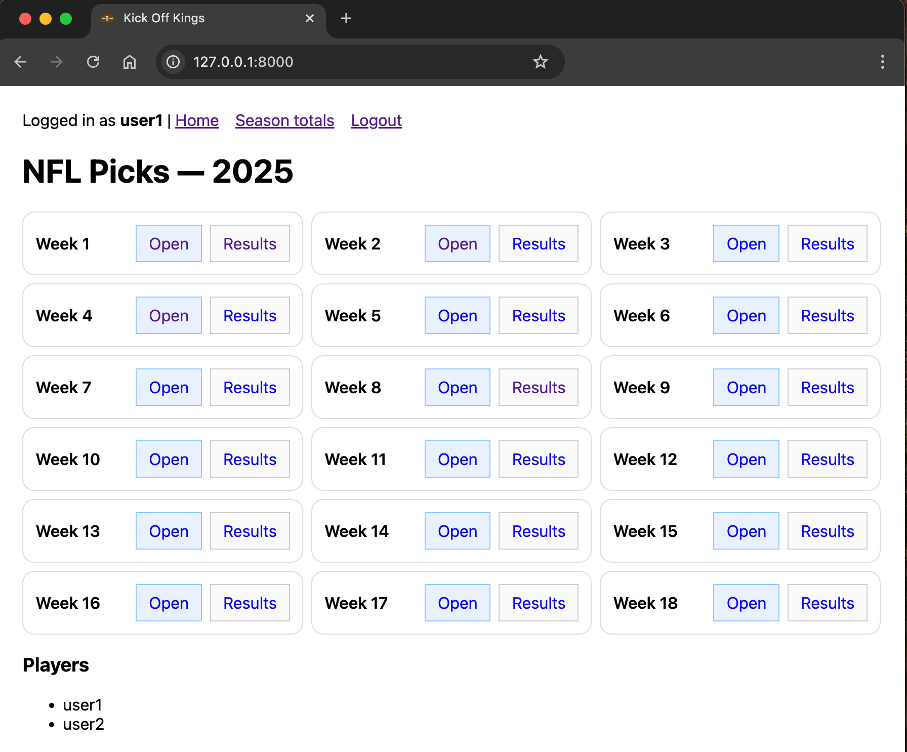

# Kick Off Kings — NFL Picks (Flask + Docker)

Self-hosted web app for making weekly NFL game picks with friends or family.  
Pulls schedules/scores from ESPN’s public feed, lets each player lock picks, and tallies wins/losses.  
Flat-file JSON storage. Easy to run locally or on a small VPS.

*Features:* Multi-user support, token login links, auto-lock picks at kickoff, weekly & season totals (regular + playoffs), caching, one-click “Refresh Results”

---

## Demo (Screens)

- **User Home**: select a week, view available weeks, quick links to results  


- **Week**: radio buttons for each game, Save Draft or Submit (lock)  


- **Results**: per-player breakdown, team abbreviations shown for picks/winners  


- **Season totals**: regular season + postseason roll-up  


---

## Quick Start (Docker)

```bash
git clone https://github.com/jmarr73/kickoff-kings.git
cd kickoff-kings
````

### 1) Setup environment

Run the provided script to generate secrets and configure users:

```bash
./setup.sh
```

The script will:

- Ask for your domain (or leave blank for local testing)
- Ask for the season year and type
- Ask how many users you want and their usernames
- Auto-generate secure random values for `FLASK_SECRET` and user tokens
- Write a ready-to-use `.env` file
- Show you your login URLs

If you’d rather create `.env` manually, here’s the format:

```ini
FLASK_SECRET=replace-with-a-long-random-string
TOKEN_USER1=replace-with-random-token
TOKEN_USER2=replace-with-random-token
NFL_YEAR=2025
NFL_SEASONTYPE=2
BUILD_ID=localdev
```

You can generate secure values like this:

```bash
# Flask secret (64 hex chars)
openssl rand -hex 32

# User tokens (48 hex chars each)
openssl rand -hex 24
```

---

### 2) Run locally (no HTTPS)

```bash
docker compose -f docker-compose.basic.yml up -d --build
```

Open: [http://localhost:8000/login/user1/YOUR\_TOKEN](http://localhost:8000/login/user1/YOUR_TOKEN)

---

### 3) Run on a VPS with HTTPS (Caddy + Let’s Encrypt)

1. Point a DNS record (e.g., `picks.yourdomain.com`) → your VPS IP.
2. Edit the `Caddyfile` in this repo to match your domain.
3. Start with:

   ```bash
   docker compose -f docker-compose.caddy.yml up -d --build
   ```

4. Open: [https://picks.yourdomain.com/login/user1/YOUR\_TOKEN](https://picks.yourdomain.com/login/user1/YOUR_TOKEN)

---

## Environment Variables

| Name             | Default | Notes                                                  |
| ---------------- | ------- | ------------------------------------------------------ |
| `FLASK_SECRET`   | (none)  | Long random string for Flask sessions                  |
| `TOKEN_USER1`    | (none)  | Token for `user1` login URL                            |
| `TOKEN_USER2`    | (none)  | Token for `user2` login URL                            |
| `NFL_YEAR`       | `2025`  | Season year                                            |
| `NFL_SEASONTYPE` | `2`     | 1 = Preseason, **2 = Regular**, 3 = Postseason         |
| `BUILD_ID`       | (none)  | Optional; used for cache busting and `/healthz` output |

---

## Data Persistence

All saved under `./data/` on the host (mounted into the container):

- Picks: `picks-<year>-<week>.json`
- Cached schedules: `schedule-<year>-<week>-t<type>.json`
- Cached results: `results-<year>-week-<week>-t<type>.json`

---

## Refresh Results

On a week’s Results page, click **🔄 Refresh Results** to bypass cache and pull live scores.

---

## VPS Deployment (Linode Example, Ubuntu 22.04)

1. Create a Linode (Nanode 1GB is enough).
2. In DNS (e.g., Namecheap), add an **A record** pointing `picks.yourdomain.com` → VPS IP.
3. Paste the `cloud-init-linode.yaml` contents into **User Data** when creating the Linode.
4. Edit placeholders (`GIT_REPO`, `DOMAIN`, `.env` values) before use.
5. After 1–2 minutes, visit `https://picks.yourdomain.com`.

---

## Development

- App entrypoint: `app.py`
- Static assets in `static/` (includes `favicon.svg` football icon)
- Run locally without Docker (for development):

  ```bash
  pip install -r requirements.txt
  python app.py
  ```

---

## License

MIT — see \[LICENSE]\(LICENSE].

---

### Acknowledgements

- ESPN public scoreboard JSON for schedules & results
- [Caddy](https://caddyserver.com/) for free HTTPS via Let’s Encrypt
